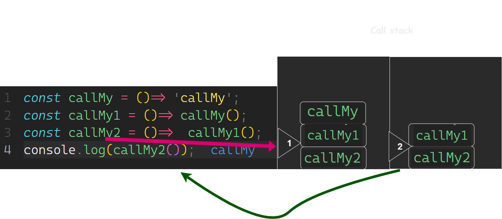

# Call Stack
- What is a ‘call’?
Last In, First Out (LIFO) principle to temporarily store and manage function invocation (call).
- How many ‘calls’ can happen at once?
one at a time.
- What does LIFO mean?
Last In, First Out.
- Draw an example of a call stack and the functions that would need to be invoked to generate that call stack. Call Stack

- What causes a Stack Overflow?
When the function call it self is the last function in the call stack.
- What is a ‘refrence error’?
thrown when a code attempts to reference a non-existing variable
- What is a ‘syntax error’?
Syntax errors are detected while compiling or parsing source code.
- What is a ‘range error’?
Range errors are thrown when a value is outside the acceptable range.
- What is a ‘tyep error’?
Type errors are thrown when a value is not of the expected type.
- What is a breakpoint?
A breakpoint is a point in the code where the debugger stops and allows the user to inspect the code.
- What does the word ‘debugger’ do in your code?
The debugger is a tool that allows you to inspect the code and see what is going on.
## Things I want to know more about
What is a ‘closure’?
